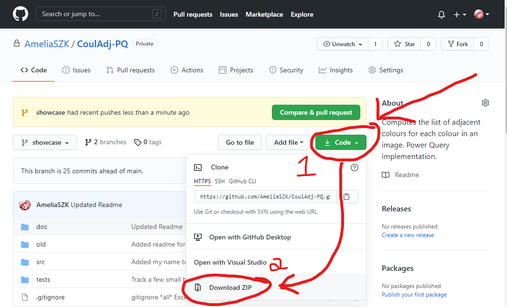

This repository was made public so that I could share with my Twitter
friends & followers.

NOTHING IN HERE IS INTENDED FOR PUBLIC CONSUMPTION.
NO GUARANTEE IS GIVEN OR IMPLIED,
I AM NOT RESPONSIBLE FOR ANYTHING,
BLA BLA BLA, YOU KNOW THE DRILL,
USE ARE YOUR OWN RISKS.

If you are nonetheless going to use this in production, these are
the main issues that, in my opinion, you should be mindful of:
1. ⚠️ **Privacy Warning**: To make the workbook functional, it *will* need to save the file path where it is located. 
Anyone with a copy of your workbook will be able to 
**retrieve the absolute file path to your workbook**.
1. The bitmap parser, `GQ_ParseBitmap`, only supports a **subset of the BMP spec**, 
and an unsupported input may **return incorrect results** instead of an error.

You are welcome to clone and fork, but be please be aware that I may put back
this repository to private at any time.

# CoulAdj-PQ
CoulAdj-PQ is a set of two Power Query functions that, together, will compute,
for each colour in a bitmap image, the list of all adjacent colours.

These two functions are `GQ_ParseBitmap` and `GQ_CoulAdj`. 
GQ_ParseBitmap can be used as a standalone, 
but GQ_CoulAdj strongly depends on GQ_ParseBitmap to work.

This repository is where I developped CoulAdj-PQ, and its main purpose is 
now to showcase my work to my Twitter friends & followers. More specifically,
this Readme caters to two main audiences:
* People who want to read the code, but can't or won't use the Excel workbook.
* People who can and want to see the code in action in the workbook.

I did not include exhaustive instructions on how to setup your local copy of the
repository & workbook to continue development, nor how to just use CoulAdj-PQ
in your own project, because writing all this documentation is starting to
become frustatingly exhausting. *(hahaha, get it? exhaustive...exhausting* 😅 *)*

> Long story short, to develop, you'll need to unzip the `bmp-samples.zip`, and
the proprietary samples are in the Assembly Kit for Total War Warhammer 2. 
Search for .bmp files of ~50 MB. Copy them to `./tests/proprietary`. Look in [GQ_ImageUnderTest_Name](./src/GQ_ImageUnderTest_Name.pq) for how to rename them.

> To use, all you need is to copy-paste the content of 
[GQ_ParseBitmap](./src/GQ_ParseBitmap.pq) 
and [GQ_CoulAdj](./src/GQ_CoulAdj.pq). Everything else is for debug and development.

# Context
*This section explains what is Power Query and why it was used to
implement CoulAdj. No instructions are contained here; feel free to skip.*

## What Is Power Query?

Power Query is a proprietary language designed by Microsoft to import and "shape"
data into Microsoft Excel and other data-processing products. 
([official website](https://docs.microsoft.com/en-us/powerquery-m/))

What is meant by "shaping data" is stuff like renaming columns, reordering,
removing them, filtering rows, text manipulation, etc etc. The main way users
are meant to interact with Power Query is through its editor. The editor provides
buttons to click, and these clicks will generate code in the Power Query M 
Formula Language. Users can view and modify this code in the Advanced Editor, 
which is actually a barebones text editor that looks more like Notepad than
Excel. For images, see the [official quick tour](https://docs.microsoft.com/en-us/powerquery-m/quick-tour-of-the-power-query-m-formula-language).

The main selling point of Power Query (imo) is the automation. If you data source
was update since the time you made your query, like, say the source was a CSV of
the sale data, and data for last week got added to the file, well you can click
a single button in your workbook to "refresh", and the query will repeat all the steps you did,
but this time with the updated file. And eveything linked to this query in your
Excel workbook will also update itself.

In our case, we use Power Query to analyze the internal database of Total War
video games, and the one-click refresh is used when the game received an update
so that our workbook stays up-to-date with the latest toys added to the game 🤓

## CoulAdj

The reason we built CoulAdj in the first place wasn't to get the colour adjacencies
in any random image, but because we wanted the *region* adjacencies in a Total War
campaign map. 

Total War games are turn-by-turn games of war, conquest, and developping your
territory. Also, the other half of the game is about waging your battles in
real-time, and is the aspect on which marketing trailers focus on.

Anywayz. Some buildings and game mechanics have effects on *adjacent* regions.
For examples, a game could make you choose between upgrading a building
to either give +10% farm income to adjacent regions, or +15% industry income
to adjacent regions. Which is better depends on what regions are adjacent, and
I enjoy building spreadsheet to perform these calculations automatically.

Another example is in Warhammer 2, where Skavens can build hidden outposts
in *foreign* regions, and in these outposts, they can make an expensive building
that, each turn, tries to create a new *free* outpost in *each* adjacent foreign region
with a 10% success rate. So for 8 adjacent regions, you get 8 attempts each turn.
In this case, the question is about where is it the most worth to build the first outpost.

Anywayz. Total War games come with an optional Assembly Kit intended for modders.
This kit contains the internal database, where we can find the list of all regions,
and it also contains bitmap images for each campaign map, where each region has
its territory identified by a distinct colour. Conveniently, in the `regions`
table of the database, we also have a colour assigned to each region.

So the goal of CoulAdj is to analyze the map, and then output the list of colour
adjacencies. Then, in Power Query, the colours are cross-reference with the
database to be replaced with their associated region. These region adjacencies
are then loaded into the Excel workbook for further processing.

## Why Implement CoulAdj in Power Query

# Known Requirements

## To read the code
If you do not mind not having syntax colouring, your web browser and this Github
repository are enough.

To get syntax colouring, you have two options:
1. [Visual Studio Code](https://code.visualstudio.com/) 
with the extension [Power Query / M Language](https://marketplace.visualstudio.com/items?itemName=PowerQuery.vscode-powerquery), made by Microsoft
1. The [Power Query Formatter](https://www.powerqueryformatter.com/formatter) website

## To use the workbook
* Windows
* Microsoft Excel

The workbook was made on Windows 10 and Excel 365. I don't know if it will
work on other versions. Excel 2016 may break. Excel 2019 will probably work.

As of May 2021, and as far as I know, Excel for Mac will not work, 
nor will Excel Online. I could be wrong about Mac, but don't get your hopes up.
The phone app (apps?) will also not work.

# Instructions
These first instructions apply to both people who only want to read the code,
and those who will use the workbook.

The two queries I recommend you to spend most of your attention on are the
Showcase queries:
* [GQ_ParseBitmap_Showcase](./src/GQ_ParseBitmap_Showcase.pq)
    * Reads a binary bitmap image file, and outputs data structures 
    native to Power Query.
* [GQ_CoulAdj_Showcase](./src/GQ_CoulAdj_Showcase.pq)
    * Computes the colour adjacencies in the image.

These queries are a copy-paste of the "real" queries, with the ~150 lines of
user documentation removed so that you can more easily tell where the
actual code starts. Additionally, the showcase queries were adapted with mock
inputs, so that workbook users could explore intermediary results 
in the Power Query GUI.

The "real" queries are:
* [GQ_ParseBitmap](./src/GQ_ParseBitmap.pq)
* [GQ_CoulAdj](./src/GQ_CoulAdj.pq)

Below are screenshots of GQ_CoulAdj and its showcase equivalent in the GUI.
Notice that:
* `GQ_CoulAdj` (1st image) has user documentation in the main area, 
and only one step in the right side pane
* `GQ_CoulAdj_Showcase` (2nd image) has results in the main area,
and many steps in the right side pane

### The function

### The showcase

Apart of these four queries, we have:

### Parameter queries
* `GQ_ImageUnderTest_Name`
* `GQ_DontRelateDiagonals`

These provide togglable inputs for use in the testbench and showcase queries.

> You may have noticed `RepoRoot` in the screenshots. It isn't prefixed with
`GQ_` so that my macros won't export it in the Git repo. 
The idea was to prevent any of my file paths to be committed to the repo. 
Notice how [line 2 in GQ_TB_ImageBinaries](https://github.com/AmeliaSZK/CoulAdj-PQ/blob/d6276e4b00365d8c876dce1835695a70ec04e734/src/GQ_TB_ImageBinaries.pq#L2) refers
to `RepoRoot` instead of a folder path. Unfortunately, it kind of became
pointless when I decided to allow that path to leak because I wanted to include
a workbook in this repo. Oh well.

### Testbench queries
Their name starts with `GQ_TB_`, and they're used to 
test results and performance. The two most important are:
* `GQ_TB_CoulAdj` to measure performance
* `GQ_TB_CompareTables` to test correctness

The other `TB` queries are mostly used to support the two above in a sensible
way.

### Documentation queries
Their name starts with `GQ_Doc_`, and I used them to verify the examples I
wrote in the user documentation.

## How to only read the code (with syntax colouring)
The queries are in `./src`, where `./` is the root of the git
repository, and where this `README.md` file is located.

### Visual Studio Code
1. Clone this repository
1. Install the [Power Query / M Language](https://marketplace.visualstudio.com/items?itemName=PowerQuery.vscode-powerquery)
extension
1. Enjoy 😊

### Power Query Formatter Website
1. Go to [https://www.powerqueryformatter.com/formatter](https://www.powerqueryformatter.com/formatter)
1. In the main area, copy-paste the code of the query you want to read.
1. Enjoy 😊

I am aware that this website may send my code to some servers for
processing or whatever. While I do prefer that you use Visual
Studio Code if you can, I care more about you not being or
feeling excluded because the only option I presented 
was my text editor of choice.

## How to use the workbook

⚠️ **Privacy Warning**: To make the workbook functional, it *will* need to save the file path where it is located. 
Anyone with a copy of your workbook will be able to 
**retrieve the absolute file path to your workbook**.

1. Acquire this repository. Two options:
    * A) Download the ZIP from Github (screenshot below)
        1. Click on `Code`
        1. Click on `Download ZIP`
        1. Once downloaded, unzip (not shown in screenshot)
    * B) Git clone with a terminal is also fine
1. Open `CoulAdj-PQ_Showcase.xlsx`
1. Follow the instructions found in the first worksheet

The instructions in the workbook come with annotated screenshots.
To see the screenshots before deciding if you're going to use the
workbook, you can go look in the [doc/](./doc) folder in the Github repo.

Excel will probably give you a security warning about 
"external connections" when you open the workbook for the first
time. You will have to click on Allow, or however it is called
in English, to make the workbook work.

I am not really sure what this is trying to warn against, since I
often see this warning for my own workbooks that only connect to
local files? My educated guess is that the danger is that a 
malicious actor could make a query retrieve any file on your 
computer (feasible), and then trick you into sending them back
the workbook.

I don't want to be flippant with the security warnings and tell you
to "just trust me", but I also really want to be finally done with 
these instructions, and the security discussion can get really
long and convoluted with several qualifiers because nothing is
ever simple in that space.

Anywayz. The *actual* risk you encounter here is the one I 
mentioned in the privacy warning above: The workbook will
store the path to its location, and if you send your workbook
to someone else, this person will be able to retrieve that path.

